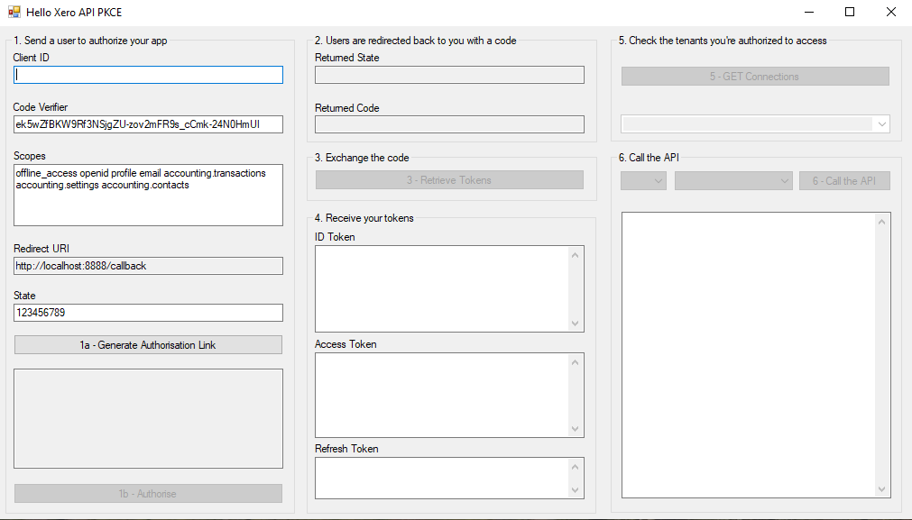
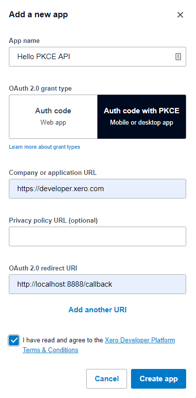

# net-desktop-pkce-example

This is a sample app to demonstrate how a desktop app can connect to the Xero API using the PKCE OAuth 2.0 flow.

This was developed on Windows using VS17 and also tested on VS19. You should be able to download the project, load it in Visual Studio and run it.

Please note the code has been optimised for clear understanding of the flow, and is not intended to be used as-is in a production environment.

The PKCE flow is described here: https://developer.xero.com/documentation/oauth2/pkce-flow The numbers on the GUI relate to the numbered steps in the guide.

## Steps to get up and running

### 1. Create an OAuth2 app at https://developer.xero.com/myapps
Go to the Xero developer portal and create an OAuth2 app.

If you haven't already signed up for a xero account you can do so [here](https://www.xero.com/signup/api/).

Use the following values:
1. App Name - your choice, but can't contain the word 'Xero'
1. Click ”Auth Code with PKCE”
1. Company or application URL - this needs to be an https address, but isn't used
1. OAuth 2.0 redirect URI - http://localhost:8888/callback
1. Click Create App

You'll then be taken to your App's Details page. Keep this page open, and load and start the project in Visual Studio.

### 2. Running the app

1. Paste the Client ID from the My Apps screen into to first text box of the app
1. Click the "Generate Authorisation Link" button
1. The rest of the buttons follow the connection process as detailed [here](https://developer.xero.com/documentation/oauth2/pkce-flow)

## How it works

In Visual Studio double-click on any of the buttons to see the code. We've tried to keep this as simple as possible so that it can be understood even if c# is not your native language.

The main consideration for a desktop app is implementing the web listener, this is started when the Authorise button is clicked. Once the code has been returned, the web listener can be stopped. The code for this can be found in [net-desktop-pkce-example/LocalHttpListener.cs](net-desktop-pkce-example/LocalHttpListener.cs)

The web listener can be kept really simple as all it needs to do is receive the callback and extract the code argument.

## Further reading

* https://developer.xero.com/documentation/oauth2/pkce-flow - Xero documentation for the PKCE flow
* https://github.com/XeroAPI/Xero-Postman-Tutorial-PKCE-Edition - Follow the PKCE flow in Postman

## License

This software is published under the [MIT License](http://en.wikipedia.org/wiki/MIT_License).

	Copyright (c) 2020 Xero Limited

	Permission is hereby granted, free of charge, to any person
	obtaining a copy of this software and associated documentation
	files (the "Software"), to deal in the Software without
	restriction, including without limitation the rights to use,
	copy, modify, merge, publish, distribute, sublicense, and/or sell
	copies of the Software, and to permit persons to whom the
	Software is furnished to do so, subject to the following
	conditions:

	The above copyright notice and this permission notice shall be
	included in all copies or substantial portions of the Software.

	THE SOFTWARE IS PROVIDED "AS IS", WITHOUT WARRANTY OF ANY KIND,
	EXPRESS OR IMPLIED, INCLUDING BUT NOT LIMITED TO THE WARRANTIES
	OF MERCHANTABILITY, FITNESS FOR A PARTICULAR PURPOSE AND
	NONINFRINGEMENT. IN NO EVENT SHALL THE AUTHORS OR COPYRIGHT
	HOLDERS BE LIABLE FOR ANY CLAIM, DAMAGES OR OTHER LIABILITY,
	WHETHER IN AN ACTION OF CONTRACT, TORT OR OTHERWISE, ARISING
	FROM, OUT OF OR IN CONNECTION WITH THE SOFTWARE OR THE USE OR
	OTHER DEALINGS IN THE SOFTWARE.
